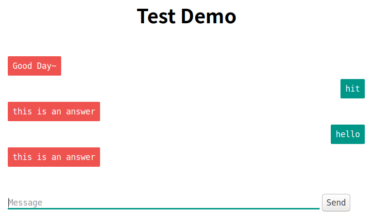

# ChatbotUI Template
A simple Python implementation of Chatbot UI for Web Service.
**Note**: This is a slight modification of the project https://github.com/chamkank/flask-chatterbot
## Requirement
- Python 3
- Flask

## Usage

One could freely customize your response generation in app.py, such as a rule-based chatbot, a generative or retrieval chatbot, all up to you.

Just run the app.py and navigate to the corresponding address in your explorer.
~~~Python
# issue the command
$ python app.py

# navigate to this address in your explorer
 * Running on http://0.0.0.0:54321/ (Press CTRL+C to quit)

# Then you should see the above figure in your explorer
~~~